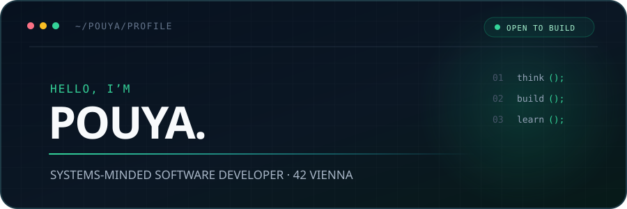
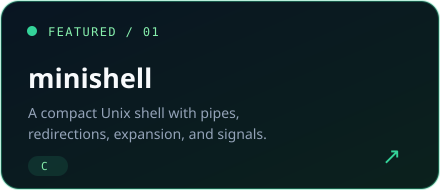
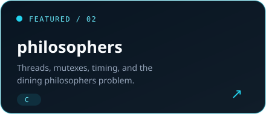
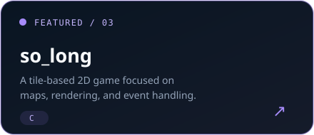
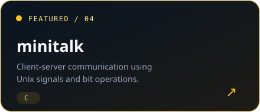
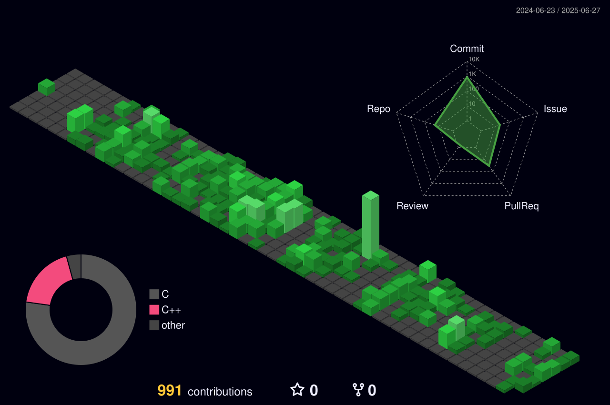

  

  
  
  

 

## A little about me

I’m a software developer studying at **42 Vienna**, drawn to the layer where software meets the machine. I enjoy turning complex problems into small, dependable programs—and understanding every abstraction I use along the way.

- Currently sharpening my systems programming through the 42 curriculum
- Working primarily with **C**, **C++**, **Bash**, and **Linux**
- Interested in Unix internals, concurrency, graphics, and developer tooling

 

## Selected work

  
  

  
  

 

## Tools I reach for

  

 

## Contribution landscape

  

Always learning. Usually debugging. Occasionally remembering the semicolon.

