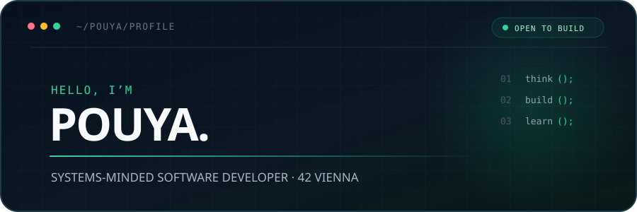
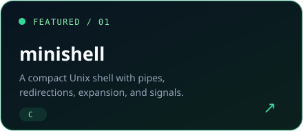
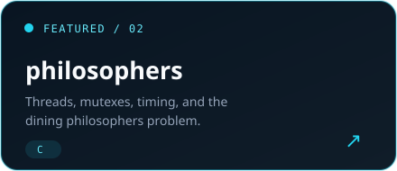
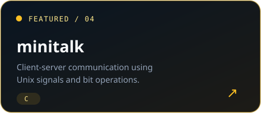

<p align="center"></p>

<p align="center">
  <a href="#selected-work"></a>
  
  <a href="https://www.42vienna.com/"></a>
</p>

## Hi, I'm Pouya

I build software at the intersection of **data, enterprise applications, automation, and systems engineering**. I work in Digital & Data at Takeda in Vienna and completed the **42 Vienna Common Core** in September 2026.

My professional work includes Power Platform applications, operational analytics, approval workflows, and integrations. The public repositories below show the parts of my engineering work that can be shared openly. My employer's internal code and data are not included.

## Selected work

| Project | Why open it |
| --- | --- |
| [**Vienna Active · ft_transcendence ↗**](https://github.com/BalazsHoc/ft_transcendence) | Final 42 team project: a full-stack sports community platform. I built the groups experience and logged-in home, contributed API integration, and owned much of the Docker, PostgreSQL and nginx deployment workflow. **Original team repository; shared ownership.** |
| [**Pharma maintenance demo**](https://github.com/with-pouyax/pharma-maintenance-powerapp-demo) | Independent sample-data Power Apps, Dataverse, Power Automate and Power BI solution. |
| [**cub3D**](https://github.com/with-pouyax/cub3D) | Textured first-person rendering from a 2D map in C. |
| [**minishell**](https://github.com/with-pouyax/minishell) | Unix shell with tokenization, expansion, redirections, pipelines and process control. |
| [**philosophers**](https://github.com/with-pouyax/philosophers) | Pthreads and mutex synchronization in a timed concurrency simulation. |
| [**CPP Modules**](https://github.com/with-pouyax/CPP-Modules) | A progression of C++98 exercises, from object-oriented design to containers and templates. |

## How I work

```text
Understand the workflow → model the data → build the interface
                       → automate the handoffs → verify the result
```

| Focus | Tools and languages |
| --- | --- |
| Software & systems | C, C++, Python, TypeScript, JavaScript, Git, Linux, Docker |
| Enterprise apps | Power Apps, Power Fx, Dataverse, Power Automate |
| Data & analytics | Power BI, Power Query, Databricks |

At Takeda I have worked on an audit request application, a change-request approval workflow, manufacturing reporting, and cross-application integration. These descriptions are deliberately high-level. The [maintenance demo](https://github.com/with-pouyax/pharma-maintenance-powerapp-demo) is an independent project with sample data.

## More 42 projects

<p align="center">
  <a href="https://github.com/with-pouyax/minishell"></a>
  <a href="https://github.com/with-pouyax/philosophers"></a>
</p>
<p align="center">
  <a href="https://github.com/with-pouyax/so_long"></a>
  <a href="https://github.com/with-pouyax/minitalk"></a>
</p>

[Browse all public repositories →](https://github.com/with-pouyax?tab=repositories&type=public)

## Connect

[LinkedIn](https://www.linkedin.com/in/pouyax/) · [GitHub](https://github.com/with-pouyax)
